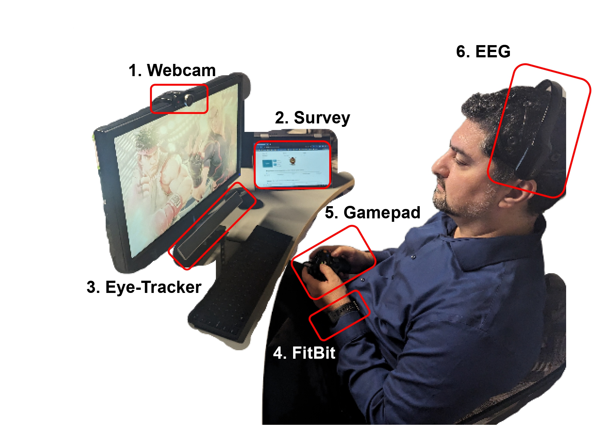

# MultiPENG: Multimodal Player Engagement Dataset
[](https://ieeexplore.ieee.org/document/10934747)
[](https://creativecommons.org/licenses/by-nc/4.0/)

This repository contains the code used for collecting and analyzing the MultiPENG dataset, a comprehensive multimodal dataset for studying player engagement in video games.

## Dataset Description
MultiPENG combines seven synchronized data streams:
- Heart rate measurements via Fitbit
- Electroencephalogram (EEG) signals
- Eye-tracking metrics
- Facial behavior analysis via OpenFace
- User input patterns
- Webcam footage
- Gameplay frames

The data collection involved 39 participants playing two popular game titles (FIFA'23 and Street Fighter V), with engagement surveys strategically integrated into natural game pauses.

## Experiment Setup


The experimental setup includes:
1. Webcam for facial expressions and head pose
2. Survey tablet for collecting real-time engagement metrics
3. Eye-Tracker for gaze and pupil tracking
4. Fitbit smartwatch for heart rate monitoring
5. Gamepad for user inputs
6. EEG headset for brain activity measurement

## Data Collection System


Our unified data collection interface shows:
- Gameplay footage
- System clock for synchronization
- EEG signal quality monitoring
- Gazepoint Control for eye tracking
- Webcam feed
- User input visualization

## Data Processing
The collected webcam footage was processed using OpenFace, a comprehensive facial behavior analysis toolkit. This processing extracted detailed facial features including:
- Head pose dynamics (translation, rotation, velocity, and acceleration vectors)
- Facial landmarks
- Gaze direction estimates
- 17 facial action unit (AU) intensities

## Repository Structure
```
MultimodalEngagement/
├── KeyLogger/         # Scripts for logging user inputs during gameplay
├── Modelling/         # Experiments, analysis notebooks, and modeling code
└── SurveyApp/         # Survey application used for collecting engagement metrics
```

## Baseline Models
Three baseline approaches for engagement prediction are included:
1. **Human Annotation Analysis**: Shows the capabilities and limitations of humans in visually assessing engagement (50±12% accuracy)
2. **Flow Theory-Based Engagement Detection**: Using player skill and game difficulty (66±6% accuracy)
3. **Multimodal Neural Architecture**: Combining EEG, eye tracking, and facial features (61±9% accuracy)

## Dataset Applications
The dataset supports various research directions including:
- Development of real-time engagement estimation models
- Cross-modal analysis of engagement indicators
- Investigation of engagement patterns across different game genres
- Evaluation of physiological vs. self-reported engagement metrics
- Flow theory modeling using difficulty-skill relationships
- Comparison of human vs. algorithmic engagement assessment

## Dataset Structure
The dataset includes:
- **Samples**: Multimodal data organized by participant and modality (EEG, EYE, HR, OpenFace, XBOX, OBS)
- **Questionnaires**: Survey data including demographics and engagement metrics
- **Splits**: Cross-validation folds for benchmarking
- **Human Panel Samples**: Curated subset for human evaluation

## Dataset Access
The complete dataset can be accessed via Kaggle:
[MultiPENG Dataset on Kaggle](https://www.kaggle.com/datasets/ammarrashed23/multimodal-player-engagement/)

## Citation
If you use this dataset or code in your research, please cite:
```
A. Rashed, S. Shirmohammadi and M. Hefeeda, "Descriptor: Multimodal Dataset for Player Engagement Analysis in Video Games (MultiPENG)," in IEEE Data Descriptions, doi: 10.1109/IEEEDATA.2025.3553097.
```

You can access the full Data Descriptor manuscript at:
[MultiPENG Paper](https://ieeexplore.ieee.org/document/10934747)

## Ethics and License
This dataset was collected under the approval of the Research Ethics Board of the University of Ottawa (Protocol #H-07-23-9439). All participants provided informed consent for their data to be shared for academic and non-commercial research purposes.

This repository and the associated dataset are released under a CC BY-NC 4.0 license.
